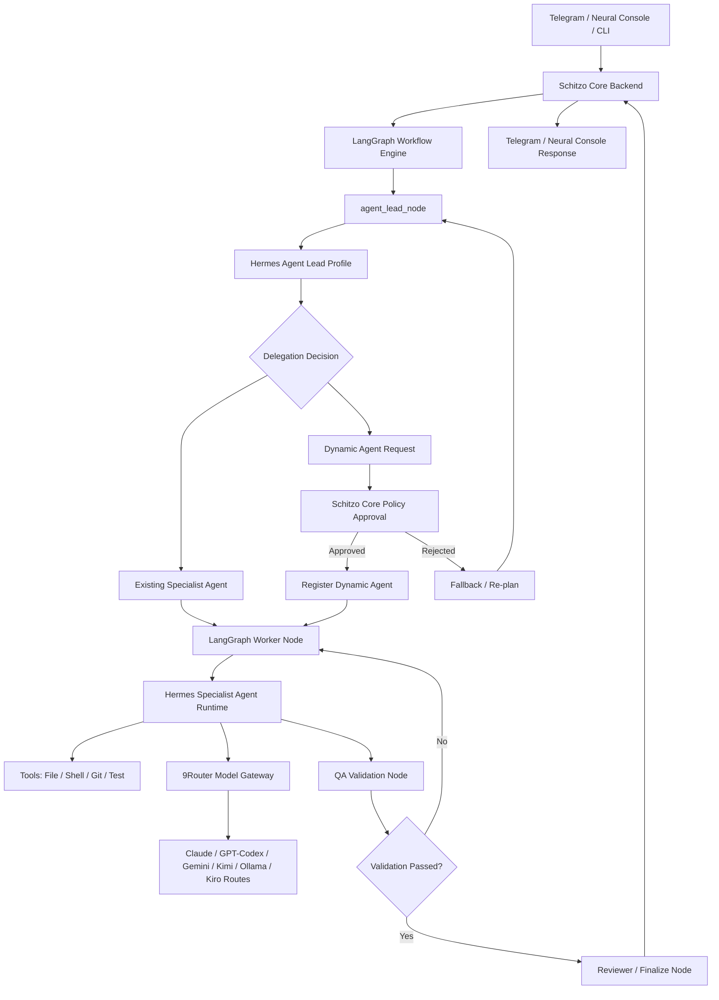
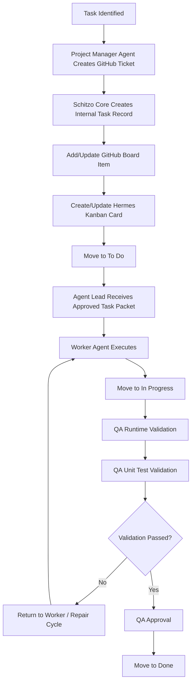
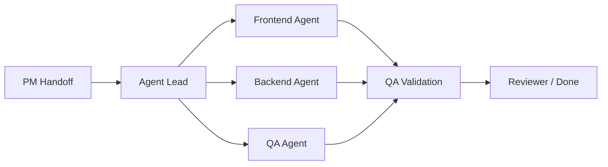

# Schitzo NeuralOS — Product & Technical Specification v1.1

**Status:** Architecture/specification ready for **Phase 0 implementation**  
**Document type:** Consolidated MVP + phased product/technical specification  
**Primary positioning:** Multi-Agent AI Operating System for project-aware software development automation

---

## 1. Product Summary

## Recommended Reading / Implementation Order

To avoid jumping between unrelated sections, implementation and onboarding should follow this order:

```text
1. Product Summary
2. Product Goals
3. MVP Scope
4. Architectural Principles
5. High-Level Architecture
6. Core Components
7. Deployment Model
8. Workflow Engine and Runtime Model
9. Agent System
10. Project and Workspace Isolation
11. Tool Execution and Safety
12. Memory and Context System
13. Git Strategy
14. Workflow State Machine
15. Approval and Telegram Governance
16. Validation and QA
17. Model Routing and Compare Mode
18. Observability and Analytics
19. Data Model
20. API Surface
21. Dashboard and UX
22. Development Phases
23. Production Hardening and Non-Goals
```

Schitzo NeuralOS is a local-first AI development orchestration platform. It allows a user to control multiple AI models, agent workflows, coding tools, GitHub work tracking, Hermes Kanban boards, and visual execution pipelines from:

- Telegram
- A web dashboard called **Neural Console**
- Interactive CLI (`schitzo`) for terminal-based task submission and status

The platform is designed to:

- Work on the Schitzo NeuralOS repository itself
- Open and manage external local projects
- Create and track development tasks as GitHub tickets and Kanban items
- Delegate work to specialized AI agents
- Run validation before work is considered complete
- Route model usage through 9Router
- Visualize workflow execution similarly to GitHub/GitLab pipelines
- Track analytics globally and per project

### Core Product Stack

```text
Schitzo Core        = backend orchestrator, APIs, persistence, security, integrations
LangGraph           = workflow graph/state machine and pipeline orchestration
Hermes              = agent runtime and agent profile execution
9Router             = model gateway and provider routing layer
Neural Console      = web dashboard
Schitzo Link        = Telegram interface
Schitzo CLI         = interactive terminal interface (like codex-cli / kiro-cli)
GitHub + Kanban     = work tracking and governance
```

---

## 2. Product Goals

Schitzo NeuralOS should enable the user to:

1. Submit tasks from Telegram, dashboard, or CLI.
2. Register and select a local project workspace.
3. Automatically create a GitHub ticket for every task.
4. Create or update a Hermes Kanban card for every task.
5. Route work through a controlled project workflow.
6. Delegate work to agents using an Agent Lead protocol.
7. Dynamically create specialist agents when needed.
8. Execute tools such as filesystem edits, shell commands, Git, and tests.
9. Validate work through QA runtime checks and unit tests.
10. Mark work Done only after validation passes.
11. Visualize active workflows in a pipeline-like dashboard.
12. Track token usage, model usage, cost estimates, and agent activity globally and per project.
13. Support Windows first, macOS second, and Linux later if prioritized.

---

## 3. MVP Scope

### 3.1 In Scope

The MVP and phased build plan include:

- Schitzo Core backend using NestJS + TypeScript
- Neural Console dashboard using Next.js + TypeScript
- Telegram bot integration
- 9Router integration
- RTK + Caveman default policy where supported by 9Router
- LangGraph workflow orchestration
- Hermes agent runtime integration
- GitHub issue/project workflow integration
- Hermes Kanban mapping per project
- Project registration from dashboard or Telegram
- Agent Lead workflow
- Founding Product Owner Agent and Project Manager Agent
- Dynamic specialist-agent creation protocol
- Tool execution: file, shell, Git, lint, test runner
- Safety/approval gates for risky commands
- Early single-user authentication baseline
- Cost estimation via Schitzo Core pricing tables
- Global and per-project analytics
- Neural Pipeline dashboard visualization
- Optional Compare Mode / Neural Arena MVP in Phase 6

### 3.2 Out of Scope for Initial MVP

The following are deferred or later-phase items:

- Multi-tenant SaaS operation
- Enterprise-grade RBAC before production hardening
- Public marketplace of agents
- Full VS Code extension
- Voice interface
- Native mobile app
- Linux as an initial MVP requirement
- Fully autonomous production deployment
- Automatic complex merge conflict resolution across parallel agents
- Ensemble execution mode as a supported MVP mode
- Deep browser visual reasoning
- Full emulator automation before Phase 8

---

## 4. Architectural Principles

### 4.1 System Responsibility Split

| Layer | Responsibility |
|---|---|
| **Schitzo Core** | Backend APIs, persistence, security, approvals, task records, GitHub/Kanban sync, pricing/cost estimation, Telegram/dashboard responses |
| **LangGraph** | Workflow graph, node execution state, transitions, branching, retries, parallel/sequential pipeline flow |
| **Hermes** | Runtime that executes agent profiles, tools, and LLM interactions |
| **Agent Lead** | A Hermes agent profile invoked by the LangGraph `agent_lead_node`; performs execution delegation reasoning |
| **9Router** | Unified model gateway and route selector for provider/model access |
| **Models** | Claude, GPT/Codex, Gemini, Kimi routes, Ollama, Kiro Provider routes, and other configured routes |
| **Neural Console** | User-facing dashboard and visual observability layer |

### 4.2 Binding Architecture Rule

```text
LangGraph owns workflow state.
Hermes executes agent reasoning and tool use.
Schitzo Core owns persistence, external integrations, security, and business policy.
```

---

## 5. High-Level Architecture



---

## 6. Core Components

## 6.1 Schitzo Core Backend

### Recommended Stack

```text
NestJS + TypeScript
PostgreSQL
Redis/BullMQ optional for queues and transient events
```

### Responsibilities

Schitzo Core must:

- Receive requests from Telegram, dashboard, and API.
- Manage users in single-user local mode initially.
- Validate project registration and project selection.
- Create canonical internal task records.
- Coordinate GitHub issue/project board creation and sync.
- Coordinate Hermes Kanban board/card creation and sync.
- Start LangGraph workflow runs.
- Persist workflow events, tool logs, messages, artifacts, and analytics.
- Enforce command approval policy.
- Enforce dynamic-agent approval policy.
- Track tokens, providers, models, and estimated cost.
- Return responses to Telegram and dashboard.
- Publish real-time events to Neural Console using WebSocket or SSE.

### What Schitzo Core Does Not Do

Schitzo Core should not replace agent reasoning. It governs and coordinates; it does not act as the LLM itself.

```text
LLM = reasoning engine
Hermes = agent runtime
LangGraph = workflow graph
Schitzo Core = control plane, persistence, policy, integrations
```

---

## 6.2 LangGraph Workflow Engine

LangGraph is the workflow graph/state-machine layer.

### Responsibilities

LangGraph must manage:

- Pipeline node execution
- Workflow state transitions
- Sequential execution
- Parallel execution
- Approval-gate nodes
- Retry and escalation transitions
- Worker-to-QA transitions
- Final response transitions
- Checkpointing when implemented

### Example Node Types

```text
project_manager_handoff_node
agent_lead_node
worker_agent_node
qa_runtime_validation_node
qa_unit_test_node
reviewer_node
approval_gate_node
final_response_node
```

### Agent Lead Execution Boundary

`agent_lead_node` is a **LangGraph workflow node**. The node invokes a **Hermes Agent Lead profile**.

```text
LangGraph agent_lead_node = workflow lifecycle, state, retry, and transitions
Hermes Agent Lead profile = reasoning, delegation proposal, dynamic-agent request, review decision
Schitzo Core = policy checks, persistence, integrations, approvals
```

---

## 6.3 Hermes Agent Runtime

Hermes is the agent execution runtime.

### Responsibilities

Hermes should:

- Execute configured agent profiles.
- Interact with models through 9Router.
- Use authorized tools.
- Return structured outputs to LangGraph/Schitzo Core.
- Run the Agent Lead profile and specialist worker profiles.

### Hermes Does Not Own

Hermes should not be the source of truth for:

- GitHub workflow state
- Cost accounting
- Dashboard persistence
- Access control policy
- Task lifecycle governance

Those remain in Schitzo Core.

---

## 6.4 9Router Model Gateway

9Router is the model routing layer.

### Responsibilities

9Router should:

- Provide a unified endpoint.
- Route requests to configured models/providers.
- Support fallback routes when configured.
- Normalize provider usage where supported.
- Allow Schitzo Core/Hermes to change models by changing the route/model field.

### Model Route Clarifications

```text
Kiro Provider routes = 9Router-exposed routes that may be Claude-backed depending on configuration. They are distinct from official Anthropic Claude API routes.
Kimi / Kimi K2 routes = 9Router-exposed provider/model routes when configured. Schitzo NeuralOS does not hardcode Kimi-specific logic outside the 9Router route layer.
```

Exact route IDs are implementation/configuration details and must be validated during integration.

### Mandatory 9Router Runtime Policy

Where supported by the configured 9Router route:

```text
RTK = enabled by default
Caveman = enabled by default
```

Schitzo Core may override only for:

- Debugging
- Provider incompatibility
- Explicit benchmark comparison
- Emergency fallback

Execution records should store:

```text
rtk_enabled
caveman_enabled
selected_model
provider_route
execution_mode
```

---

## 6.5 Neural Console Dashboard

Neural Console is the web dashboard.

### Recommended Stack

```text
Next.js
React Flow
Tailwind CSS
Recharts
WebSocket or SSE
```

### Main Modules

- Overview
- Projects
- Project Kanban
- Neural Pipeline
- Tasks
- Agents
- Approval Queue
- Global Analytics
- Per-Project Analytics
- Neural Arena in Phase 6

---

## 6.6 Telegram Interface — Schitzo Link

Telegram acts as the remote control channel.

### Example Commands

```text
/run Fix Jest error in current project
/status
/approve task_123
/reject task_123
/cancel task_123
/project C:\Projects\my-app
/project /Users/rizky/projects/my-app
/project list
/project select my-app
/project current
/project kanban
/project usage
/compare Compare Claude vs GPT for this issue
```

---

## 7. Agent System

## 7.1 Founding Agent Team in Phase 0

At the beginning of Phase 0, only these agents exist:

```text
1. Product Owner Agent
2. Project Manager Agent
```

All other specialist agents are created **on demand** when the product and project require them.

---

## 7.2 Product Owner Agent

### Responsibilities

- Protect product intent.
- Interpret the master specification.
- Confirm MVP scope.
- Approve or reject scope expansion.
- Define high-level acceptance criteria.
- Collaborate with Project Manager Agent on team formation.
- Ensure phase work aligns with the product direction.

---

## 7.3 Project Manager Agent

### Responsibilities

Project Manager Agent owns **planning governance and work tracking**, not runtime delegation.

It must:

- Translate spec items into implementation tickets.
- Create GitHub issues and project-board items.
- Ensure every task exists before implementation begins.
- Manage status movement in the planning lifecycle.
- Create approved task packets once work is ready.
- Coordinate with Product Owner Agent on scope.
- Coordinate with Agent Lead through a defined handoff.

---

## 7.4 Project Manager Agent → Agent Lead Handoff

```text
1. Product Owner Agent confirms scope when needed.
2. Project Manager Agent creates or validates GitHub ticket and board item.
3. Schitzo Core creates the canonical internal task record and links GitHub/Hermes IDs.
4. When the task is ready, board status becomes To Do.
5. Schitzo Core creates an approved task packet.
6. LangGraph invokes agent_lead_node with that task packet.
7. Hermes Agent Lead profile chooses runtime delegation among allowed options.
```

### Boundary Clarification

```text
Project Manager Agent = planning, ticketing, workflow governance
Agent Lead = runtime delegation and execution coordination
```

---

## 7.5 Agent Lead Protocol

The Agent Lead is a Hermes profile invoked by LangGraph.

### Responsibilities

- Receive approved task packet.
- Understand execution goal and constraints.
- Consult available agent registry.
- Propose specialist worker assignments.
- Select sequential or parallel execution within policy.
- Request dynamic specialist agent creation when needed.
- Review worker outputs before forwarding to the next workflow stage.
- Return structured decisions to LangGraph/Schitzo Core.

---

## 7.6 Dynamic Agent Creation Protocol

### Dynamic Agent Approval Rule

Agent Lead may request a new agent, but Schitzo Core decides whether it activates.

#### Auto-Approve Only If

- Agent is temporary.
- Agent is scoped to the current project/task.
- Tool permissions are within existing low-risk policy.
- Model/cost tier remains within configured budget.
- No production or destructive permission is requested.

#### Human Approval Required If

- Elevated shell permissions are requested.
- Destructive tools are requested.
- Production access is requested.
- The request exceeds budget policy.
- The agent should become permanent.

Approval may occur through Telegram or Neural Console.

### Required Agent Metadata

```text
agent_name
role
reason_needed
task_categories
allowed_tools
default_model_tier
fallback_model_tier
collaboration_rules
qa_review_expectations
permanent_or_temporary
scope
created_by
expires_after_task
```

---

## 7.7 Potential Specialist Agent Catalog

The following list is a **catalog**, not a startup requirement:

- Architect Agent
- Backend Agent
- Frontend Agent
- Dashboard/UI Agent
- QA Agent
- DevOps Agent
- GitHub Integration Agent
- LangGraph Workflow Agent
- Hermes Runtime Agent
- 9Router Integration Agent
- Security Agent
- Cross-Platform Runtime Agent
- Reviewer Agent
- Evaluator Agent for Compare Mode

---

## 8. Universal Development Workflow Protocol

This protocol applies to **every Schitzo NeuralOS implementation task starting in Phase 0**.

```text
No task may be implemented without:
1. GitHub ticket creation
2. Board item creation/update
3. Movement to To Do before execution
4. Worker execution
5. QA validation
6. Runtime validation when applicable
7. Unit test validation when applicable
8. Movement to Done only after validation passes
```

### Workflow Diagram



---

## 9. GitHub + Hermes Kanban + Schitzo Core Sync Model

Every task must have:

- A Schitzo Core internal task record
- A GitHub issue/ticket
- A GitHub project board item when applicable
- A Hermes Kanban card when project runtime tracking is active

### Source of Truth

```text
Schitzo Core internal task record = canonical execution source of truth
GitHub issue/project board = external planning and human-visible work tracking
Hermes Kanban card = agent-runtime execution board
Schitzo Core Sync Service = owner of synchronization
```

### Sync Rules

- Schitzo Core writes workflow transitions to GitHub and Hermes Kanban.
- Schitzo Core stores all external IDs.
- If external board state diverges from internal state, Schitzo Core logs a sync warning.
- MVP does not silently overwrite unexplained manual divergence.
- Divergence must be surfaced for review or explicit sync action.

### Recommended Board Columns

```text
Backlog
To Do
In Progress
QA Review
Done
Failed
Blocked
```

---

## 10. Multi-Project Workspace Support

Schitzo NeuralOS should support external local projects.

### Add Project Through Dashboard

```text
Add Project → Enter full local path → Validate path → Register workspace → Link/create Kanban
```

### Add Project Through Telegram

```text
/project C:\Projects\my-app
/project /Users/rizky/projects/my-app
```

### Registered Project Metadata

```text
project_id
project_name
project_path
git_remote_url
github_repo
github_project_id
hermes_kanban_board_id
created_at
last_used_at
```

### Project Workspace Dashboard Features

- List all previously used projects
- Select current project
- Open project Kanban
- Open project pipeline history
- Open project analytics
- View task history
- Archive/remove from Schitzo tracking

---

## 11. Execution Modes

### 11.1 Supported Execution Behaviors

| Mode | Status | Description |
|---|---|---|
| **single** | Supported | Default one-agent/one-model execution |
| **compare** | Supported when explicitly requested | Same task across selected models for evaluation |
| **fallback** | Supported as failure policy | Retry/escalate after bounded failure |
| **vote** | Deferred | Future multi-output adjudication strategy |
| **tournament** | Deferred | Future evaluator-ranking strategy |
| **ensemble** | Deferred | Future merge/composition strategy |

### 11.2 Compare Mode Policy

Compare Mode is **not default**.

It runs only when:

- User explicitly requests it
- Workflow configuration explicitly enables it
- Benchmarking/debugging policy enables it

Example:

```text
/compare Compare Claude vs GPT for fixing this Jest issue
```

### 11.3 Neural Arena

**Phase 6 delivers Neural Arena MVP.**

Neural Arena allows side-by-side comparison of:

- Models
- Providers
- Agent outputs
- Cost
- Speed
- Test results
- Evaluation score

Later phases may add replay, benchmark history, richer charts, and scoring customization.

---

## 12. Retry, Repair, and Escalation Policy

Retries must be bounded.

```text
max_provider_retries = 2
max_worker_repair_cycles = 2
max_model_escalations = 1
```

### Failure Handling

| Failure Type | Policy |
|---|---|
| Provider timeout / temporary provider failure | Retry up to 2 times with exponential backoff |
| Tool transient failure | Retry once if safe |
| Code/test failure | Return to worker, max 2 repair cycles |
| Failure after one model escalation | Mark Failed or Blocked and notify user |

### Fallback Meaning

Fallback is a failure-handling route, not a parallel comparison mode.

---

## 13. Agent Communication Protocol

Agents may collaborate, but communication must be controlled and durable.

### Binding Communication Model

```text
PostgreSQL = durable agent messages, handoffs, and artifact metadata
LangGraph state = scoped task state and references to relevant message/artifact IDs
Hermes agents = read/write via Schitzo Core messaging/tool APIs
Redis / WebSocket / SSE = transient delivery and dashboard updates only, not durable source of truth
```

### Message Record

```text
agent_message_id
project_id
task_id
from_agent
to_agent_or_channel
message_type
payload
created_at
consumed_at
```

### Communication Rules

- Agents communicate through controlled channels only.
- All inter-agent messages are logged.
- Agent Lead supervises execution collaboration.
- Reviewer/QA checks final result quality.
- Artifact references are preferred over dumping large payloads into messages.

---

## 14. Artifact Registry

### MVP Storage Strategy

```text
Artifact file content: local filesystem
Artifact metadata: PostgreSQL
Default path: <project>/.schitzo/artifacts/
```

### Artifact Examples

- Patch files
- Code snapshots
- Markdown documents
- Architecture diagrams
- API contract outputs
- Test reports
- Screenshots
- Logs

### Artifact Metadata

```text
artifact_id
project_id
task_id
agent_run_id
artifact_type
relative_path
version
checksum
created_by_agent
created_at
```

---

## 15. Parallel Execution and Conflict Policy

MVP must avoid overlapping write conflicts instead of attempting automatic conflict resolution.

```text
- Agent Lead assigns non-overlapping file/work scopes before parallel execution.
- Parallel agents must not edit the same file set at the same time.
- If two agents require the same file scope, execution becomes sequential or is re-partitioned.
- Reviewer Agent validates the final diff and validation results.
```

Deferred future enhancement:

- Branch/worktree per agent
- Automated merge analysis
- Conflict-aware patch application

---

## 16. Tool Execution Layer

### MVP Tools

```text
filesystem.read
filesystem.write
filesystem.patch
shell.execute
git.status
git.diff
git.commit
test.run
lint.run
package.install
```

### Future Tools

```text
browser.open
browser.click
browser.screenshot
browser.extract
emulator.start
emulator.install_apk
emulator.run_test
github.create_pr
figma.fetch_design
jira.create_ticket
```

---

## 17. Safety, Approval, and Early Authentication

### Commands Requiring Approval

```text
rm -rf
format
del /s
sudo
npm publish
git push --force
git reset --hard
docker system prune
kubernetes delete
production deployment commands
```

### Approval Flow

```text
Agent requests risky action
→ Schitzo Core pauses workflow
→ Telegram/Dashboard requests approval
→ User approves or rejects
→ Workflow resumes or cancels action
```

### Early Authentication Baseline

Full RBAC is deferred to production hardening, but basic access control exists from the start:

```text
- single-user local mode by default
- Telegram allowlist by Telegram user ID
- dashboard protected by local admin token or authenticated local session
- backend API protected by auth token
- backend bound to localhost by default where practical
- shell/tool actions logged
```

---

## 18. QA Validation and Quality Gates

### Mandatory Validation Before Done

```text
- runtime validation passes when applicable
- unit tests pass
- lint/typecheck passes when configured
- QA Agent approves result
- workflow statuses are synchronized
```

### Test and Coverage Policy

```text
100% test pass rate = mandatory
90% code coverage = default minimum target unless project policy explicitly overrides it
```

Coverage reporting should exist before coverage enforcement becomes active.

### Runtime Validation Examples

- Application starts without runtime crash
- TypeScript compile passes
- API contract/request validation passes
- UI rendering checks pass when relevant
- Test runner command completes successfully

---

## 19. Cross-Platform Runtime Layer

### Platform Priority

```text
1. Windows 10 / 11 — initial implementation baseline
2. macOS Apple Silicon / Intel — second supported platform
3. Linux — optional future support, not required for initial MVP unless explicitly prioritized
```

The operating-system priority is independent from the product phase numbering.

### Runtime Responsibilities

- Detect OS
- Normalize file paths
- Normalize shell execution
- Normalize environment variables
- Normalize process handling
- Inject OS context into agent prompts

### Example Agent Runtime Context

```text
Current OS: Windows 11
Shell: PowerShell
Project Path: C:\Projects\app
Package Manager: npm
```

### Recommended Node.js Libraries

```text
node:os
node:path
cross-spawn
execa
dotenv
zx optional
```

---

## 20. Model Usage and Cost Estimation

Schitzo Core must calculate estimated cost itself.

### Pricing Source

Use configurable pricing data:

```text
model_pricing
- provider
- model
- input_price_per_1m_tokens
- output_price_per_1m_tokens
- effective_date
- pricing_version
```

### Usage Record

```text
input_tokens
output_tokens
model_name
provider_route
pricing_version
estimated_cost
```

9Router analytics may be shown as supplemental information where available, but Schitzo Core remains the source of truth for dashboard cost estimates.

---

## 21. Data Model

### users

```text
id
telegram_user_id
name
email
created_at
updated_at
```

### projects

```text
id
user_id
name
path
git_remote_url
github_repo
github_project_id
hermes_kanban_board_id
default_branch
last_used_at
created_at
updated_at
```

### tasks

```text
id
project_id
user_prompt
task_type
difficulty
status
execution_mode
github_issue_id
github_project_item_id
hermes_kanban_card_id
created_at
updated_at
completed_at
```

### agent_runs

```text
id
task_id
agent_name
model_name
provider_route
status
input_tokens
output_tokens
rtk_enabled
caveman_enabled
started_at
completed_at
```

### tool_calls

```text
id
task_id
agent_run_id
tool_name
command
status
risk_level
requires_approval
approved_by_user
stdout
stderr
created_at
```

### model_usage

```text
id
task_id
agent_run_id
model_name
provider_route
input_tokens
output_tokens
pricing_version
estimated_cost
created_at
```

### model_pricing

```text
id
provider
model
input_price_per_1m_tokens
output_price_per_1m_tokens
effective_date
pricing_version
created_at
updated_at
```

### agent_messages

```text
id
project_id
task_id
from_agent
to_agent_or_channel
message_type
payload
created_at
consumed_at
```

### artifacts

```text
id
project_id
task_id
agent_run_id
artifact_type
relative_path
version
checksum
created_by_agent
created_at
```

### logs

```text
id
task_id
level
message
metadata
created_at
```

---

## 22. API Surface — Initial Recommendation

### Tasks

```text
POST /tasks
GET /tasks
GET /tasks/:id
POST /tasks/:id/cancel
POST /tasks/:id/retry
```

### Projects

```text
POST /projects
GET /projects
GET /projects/:id
PATCH /projects/:id
DELETE /projects/:id
```

### Agents

```text
GET /agents
GET /agents/:id
POST /agents/dynamic-requests/:id/approve
POST /agents/dynamic-requests/:id/reject
PATCH /agents/:id/config
```

### Approvals

```text
GET /approvals
POST /approvals/:id/approve
POST /approvals/:id/reject
```

### Usage

```text
GET /usage/models
GET /usage/tokens
GET /usage/costs
GET /usage/projects/:id
```

### Kanban/Sync

```text
GET /projects/:id/kanban
POST /sync/github/:taskId
POST /sync/hermes/:taskId
```

### Telegram

```text
POST /telegram/webhook
```

---

## 23. Neural Pipeline Dashboard

The pipeline view should resemble GitHub/GitLab CI workflows.



### Node Statuses

```text
pending
running
success
failed
waiting_approval
retrying
skipped
cancelled
blocked
```

### Node Detail Drawer

Each node should expose:

- Agent name
- Role
- Model route
- Provider
- RTK/Caveman status
- Tool calls
- Logs
- Input/output tokens
- Estimated cost
- Duration
- Retry count
- Artifacts
- QA result

---

## 24. Analytics Requirements

Analytics must support:

```text
Scope: Global / Per Project
```

### Metrics

- Total tasks
- Completed tasks
- Failed tasks
- Active agents
- Most used model
- Model usage over time
- Token input/output usage
- Estimated cost
- Provider route usage
- Average task duration
- Runtime validation pass rate
- Unit test pass rate
- QA pass rate
- Compare Mode usage

---

## 25. Development Phases

## Phase 0 — Project Foundation, Repository Setup, and Founding Agent Team

### Goal

Create the project foundation and the two founding agents.

### Initial Agents

```text
1. Product Owner Agent
2. Project Manager Agent
```

### Deliverables

- Create GitHub repository
- Setup GitHub project board
- Setup issue templates and PR template
- Initialize monorepo structure
- Setup NestJS Schitzo Core backend
- Setup Next.js Neural Console dashboard
- Setup shared TypeScript packages
- Setup ESLint/Prettier
- Setup unit-test framework
- Setup baseline CI
- Setup local environment files
- Setup early auth baseline
- Document Agent Creation Protocol
- Define Product Owner Agent
- Define Project Manager Agent
- Analyze which agents are required for Phase 1

### Suggested Phase 0 Tickets

```text
1. Initialize Schitzo NeuralOS GitHub repository
2. Setup project board columns
3. Setup monorepo workspace
4. Setup NestJS Core API
5. Setup Next.js Neural Console
6. Setup shared configs/packages
7. Setup lint/prettier
8. Setup tests and CI baseline
9. Setup issue/PR templates
10. Setup early auth baseline
11. Define Product Owner Agent
12. Define Project Manager Agent
13. Define Agent Creation Protocol
14. Document local developer workflow
```

### Acceptance Criteria

- Repo exists and is usable.
- Backend and dashboard start locally.
- CI/lint/tests work.
- GitHub board exists.
- PO Agent and PM Agent definitions exist.
- Agent Creation Protocol exists.
- Early access baseline exists.
- Every Phase 0 task follows ticket → board → execution → QA → Done.

---

## Phase 1 — Basic Control Loop

```text
Telegram → Schitzo Core → 9Router → Model → Telegram
```

Deliverables:

- Telegram bot webhook
- Task intake
- Selected model route call
- 9Router integration
- Basic task logs
- Telegram response

---

## Phase 2 — LangGraph Pipeline Foundation

```text
Schitzo Core → LangGraph → Agent Lead → Final Response
```

Deliverables:

- Workflow run creation
- `agent_lead_node`
- Task state transitions
- Basic retry support
- Final response node

---

## Phase 3 — Hermes Runtime + Tool Execution

```text
LangGraph Node → Hermes Agent → Tools → Result
```

Deliverables:

- Hermes integration
- File tools
- Shell tool
- Git tool
- Test runner
- Approval flow
- QA runtime/test support begins

---

## Phase 4 — Neural Pipeline Dashboard

Deliverables:

- React Flow pipeline visualization
- Real-time workflow events
- Node status display
- Tool/log drawers
- Usage by task

---

## Phase 5 — Multi-Agent Collaboration

Deliverables:

- Agent registry growth
- Frontend/Backend/QA/Reviewer as needed
- Communication protocol implementation
- Artifact registry implementation
- Parallel execution with write-scope rules

---

## Phase 6 — Compare Mode / Neural Arena MVP

Deliverables:

- Optional Compare Mode
- Evaluator agent as needed
- Side-by-side result view
- Cost/speed/quality comparison
- Neural Arena dashboard MVP

---

## Phase 7 — Smart Model Optimization

Deliverables:

- Budget modes
- Model escalation policy
- Fallback routing
- Provider health status
- Cost-aware selection

---

## Phase 8 — Advanced Automation

Deliverables:

- Browser automation
- Android emulator automation
- PR creation
- CI/CD workflow integration
- Deployment approval gates

---

## Phase 9 — Production Hardening

Deliverables:

- Full RBAC
- Expanded audit logs
- Workspace isolation improvements
- Encrypted secrets
- Backup/restore
- Crash recovery
- Provider failover hardening

---

## 26. Implementation Readiness

The spec is ready to start **Phase 0**.

### Resolved Decisions

```text
- LangGraph owns workflow state; Hermes executes Agent Lead and specialist profiles.
- Project Manager Agent governs planning/tickets; Agent Lead governs runtime delegation.
- Agent communication is durable through Schitzo Core/PostgreSQL with LangGraph state references.
- Phase 0 starts with only Product Owner Agent and Project Manager Agent.
- Schitzo Core internal task record is the sync source of truth for GitHub and Hermes Kanban.
- Supported execution behaviors are single, compare, and fallback; ensemble is deferred.
- Retries, repair cycles, and model escalation are bounded.
- Dynamic-agent approval is policy-based with human approval for elevated cases.
- Parallel editing avoids overlapping write scopes in MVP.
- Basic authentication is mandatory from the start.
- Cost estimation uses Schitzo Core pricing tables.
- Kiro/Kimi are 9Router routes when configured.
- Artifacts use project-local filesystem storage plus PostgreSQL metadata.
- Neural Arena MVP is delivered in Phase 6.
- 100% test pass rate is mandatory; 90% coverage is the default minimum target unless overridden.
- Linux is optional future support, not an initial MVP requirement.
```

### Technical Validation Items During Implementation

The following are implementation validations, not unresolved product requirements:

- Exact Hermes invocation/API shape
- Exact Hermes Kanban integration surface
- Exact 9Router request fields for RTK/Caveman
- Exact provider route IDs for Kiro/Kimi/Codex/etc.
- LangGraph JS vs Python integration decision if constraints appear

These should be validated during Phase 0/Phase 1 engineering spikes or tickets.


---

# 27. Architecture Clarifications and Operational Policies

## 27.1 LangGraph Runtime Decision

### Binding Runtime Decision

```text
LangGraph runtime = TypeScript/JavaScript by default.

Python LangGraph is deferred unless a required feature is unavailable in LangGraph JS.

Schitzo Core, LangGraph workflow, Hermes adapter, and tool execution should run in the same TypeScript ecosystem for MVP.
```

### Rationale

This decision reduces:

- Cross-runtime orchestration complexity
- Serialization overhead
- Deployment fragmentation
- Inter-process integration complexity
- Observability fragmentation

This also aligns with:

```text
NestJS
Next.js
TypeScript shared packages
BullMQ
Hermes integration adapters
```

---

## 27.2 Queue and Execution Model

### Workflow Execution Model

Workflow execution must be asynchronous.

```text
Schitzo Core creates workflow_run records.
BullMQ schedules workflow jobs.
Worker process executes LangGraph runs.
Redis manages queue state and transient coordination.
PostgreSQL remains the durable source of truth.
```

### MVP Process Model

```text
API Process:
- receives Telegram/dashboard/API requests
- validates requests
- persists records
- enqueues workflow jobs

Worker Process:
- executes LangGraph workflows
- invokes Hermes runtime
- runs tools
- updates workflow state
```

### Concurrency Policy

```text
global_workflow_concurrency = 1
per_project_concurrency = 1
parallel_agent_concurrency = 2 when enabled
```

### Long-Running Workflow Handling

```text
Long-running workflows must support:
- checkpoint persistence
- resumable workflow state
- worker crash recovery
- queue retry coordination
```

### Cancellation Policy

```text
Workflow cancellation must:
- mark workflow as cancelling
- stop new node scheduling
- terminate running tools where safe
- persist cancellation reason
- transition workflow to cancelled
```

---

## 27.3 Approval Pause and Resume Lifecycle

### Approval Workflow State

When approval is required:

```text
workflow_status = waiting_approval
```

### Required Approval Metadata

```text
approval_id
approval_required_for
approval_requested_at
approval_timeout_at
resume_from_node
resume_payload
approved_by
approval_decision
```

### Timeout Policy

```text
default_approval_timeout = 24 hours
```

If approval expires:

```text
workflow_status = blocked
```

### Resume Policy

Approved workflows resume from:

```text
resume_from_node
```

using:

```text
resume_payload
```

### Approval Race Protection

```text
Only the first valid approval/rejection action may mutate workflow state.

Subsequent duplicate approval attempts must be ignored and logged.
```

---

## 27.4 Memory and Context Management

### Layered Memory Model

Schitzo NeuralOS uses layered memory.

### Task Memory

Short-term execution memory for the active workflow/task.

Examples:

- active reasoning summaries
- current execution context
- recent tool outputs
- temporary planning state

### Conversation Memory

Stores Telegram/dashboard conversation history related to the task.

### Project Knowledge Store

Long-term project memory storing:

- architecture summaries
- coding conventions
- setup commands
- dependency notes
- recurring fixes
- project decisions

### Artifact Retrieval Layer

References and retrieves:

- logs
- screenshots
- generated files
- diffs
- markdown reports
- test outputs
- architecture artifacts

### Execution Summary Compression

Long execution chains should be summarized periodically to reduce token consumption and context overflow.

### MVP Storage Strategy

```text
PostgreSQL:
- memory metadata
- summaries
- references

Local filesystem:
- large artifacts
- logs
- generated outputs
```

### Vector Retrieval Policy

```text
Vector retrieval is deferred for early MVP.

Keyword search + summaries are sufficient initially.

Vector indexing may be added in later phases when project memory size becomes large.
```

---

## 27.5 Tool Sandboxing and Runtime Isolation

### Workspace Restriction

All tools must execute within the registered project workspace.

### Mandatory Protections

Tool execution must enforce:

```text
- allowed project root
- path traversal protection
- working-directory restriction
- command timeout
- process kill on timeout
- max output capture size
- risky-command approval
- command logging
```

### Runtime Limits

```text
shell_timeout_seconds = 120
test_timeout_seconds = 300
max_stdout_stderr_capture = 1MB
```

### Restricted Operations

The following operations require approval:

```text
- filesystem access outside project root
- destructive commands
- production commands
- global system modification
- package manager global installs
```

### Windows Runtime Stability Policy

To reduce Windows shell instability:

```text
- spawned processes must be tracked
- orphan process cleanup should exist
- PowerShell execution policy failures must be handled gracefully
- long-running child processes should support termination
```

---

## 27.6 Formal Workflow State Machine

### Canonical Workflow States

| Current State | Allowed Next State |
|---|---|
| pending | queued, cancelled |
| queued | running, cancelled |
| running | waiting_approval, retrying, success, failed, blocked, cancelled |
| waiting_approval | running, blocked, cancelled |
| retrying | running, failed, blocked |
| success | done |
| failed | retrying, blocked |
| blocked | running, cancelled |
| done | archived |
| cancelled | archived |

### Terminal States

```text
done
cancelled
archived
```

### Workflow State Governance

```text
Schitzo Core is the canonical owner of workflow state persistence.
LangGraph owns active execution transitions.
Dashboard state must derive from canonical persisted workflow state.
```

---

## 27.7 Compare Mode Evaluator Policy

### Hybrid Evaluation Strategy

Compare Mode uses hybrid evaluation scoring.

### Default Weighted Score

| Metric | Weight |
|---|---|
| Test Result Score | 40% |
| Implementation Quality Score | 25% |
| Cost Efficiency Score | 15% |
| Speed Score | 10% |
| Maintainability Score | 10% |

### Evaluator Rules

```text
If tests fail, the candidate cannot win unless all candidates fail.

Human override is allowed.

Evaluator Agent must explain scoring before final recommendation.
```

### Evaluation Sources

Evaluation may include:

- automated test results
- lint/typecheck results
- runtime validation
- LLM-based code review
- execution duration
- token/cost usage

---

## 27.8 Persistence Cleanup and Retention Policy

### Default Retention Policy

```text
workflow logs = 30 days
failed workflow logs = 60 days
artifacts = retained until manual deletion
token/cost records = retained unless archived
temporary runtime files = periodically cleaned
```

### Cleanup Responsibilities

Daily cleanup job should remove:

```text
- expired transient logs
- stale queue records
- temporary runtime files
- abandoned checkpoints
```

### Archive Policy

Archived workflows:

```text
- remain queryable
- become read-only
- are excluded from active workflow scheduling
```

---

## 27.9 Temporary Agent Lifecycle

### Temporary Agent Persistence

Temporary agents are persisted during active execution.

### Post-Execution Behavior

After task completion:

```text
- temporary agent configuration is archived
- execution history remains
- agent is not reusable by default
```

### Capability Promotion

If similar temporary agents are repeatedly created:

```text
Agent Lead may propose promotion to reusable specialist agent.
```

Promotion requires approval.

---

## 27.10 QA Validation Model

### Hybrid QA Model

QA validation is hybrid.

Validation layers:

```text
1. rule-based validation
2. test/lint/typecheck validation
3. runtime validation
4. LLM-based review when needed
```

### QA Restrictions

```text
QA Agent cannot mark Done if mandatory validation fails.
```

### QA Escalation

If QA confidence is low:

```text
- workflow may return to worker repair cycle
- reviewer escalation may occur
- human review may be requested
```

---

## 27.11 Cost Estimation Precision Policy

### MVP Cost Policy

Cost estimation is approximate during MVP.

### Required Tracking

Schitzo Core should track:

```text
- input tokens
- output tokens
- provider route
- selected model
- retries
- failed attempts
- pricing version
```

### Future Enhancements

Future versions may support:

```text
- cached token pricing
- streaming token correction
- provider invoice reconciliation
- reasoning-token pricing
- provider-specific token normalization
```


---

# 28. Final Implementation Clarifications

## 28.1 Hermes Integration Contract

Hermes integration must use a structured input/output contract so Schitzo Core, LangGraph, Hermes, and the dashboard can exchange predictable execution data.

### Hermes Input Contract

```text
task_packet
agent_profile
project_context
memory_context
allowed_tools
approval_policy
execution_mode
model_route
workflow_run_id
task_id
project_id
```

### Hermes Output Contract

```text
status
summary
messages
proposed_actions
tool_calls
artifacts
token_usage
next_action
error
```

### Ownership Rule

```text
Hermes does not directly mutate canonical task or workflow status.

Hermes returns structured execution results.
Schitzo Core persists results and governs state transitions.
LangGraph manages active workflow transitions.
```

---

## 28.2 Agent Prompt Governance

Agent prompts must be versioned and composed from controlled layers.

### Prompt Layers

```text
1. global_system_prompt
2. agent_role_prompt
3. project_context_prompt
4. task_specific_prompt
5. runtime_safety_constraints
6. memory_and_artifact_references
```

### Required Run Metadata

Each agent run must store:

```text
prompt_version
agent_profile_version
model_route
project_context_version
memory_context_refs
```

### Prompt Governance Rule

```text
Agent behavior must be traceable to the prompt and profile version used during execution.
```

---

## 28.3 Artifact Versioning Rules

Artifacts are immutable by default.

If an artifact changes, Schitzo NeuralOS must create a new artifact version instead of silently overwriting the previous file.

### Artifact Version Metadata

```text
artifact_id
version
relative_path
checksum
created_at
created_by_agent
task_id
agent_run_id
```

### Artifact Rule

```text
Never overwrite previous artifact versions silently.
```

---

## 28.4 Git Strategy

Schitzo NeuralOS uses the following Git flow:

```text
feature/<ticket-number>-<short-slug> → develop → main
```

### Git Rules

```text
- Every implementation task must start from develop.
- Every implementation task gets its own feature branch.
- Worker agents commit only task-related changes.
- Merge to develop happens only after QA validation passes.
- Merge to main requires final human approval or release process.
- Agents must not overwrite unrelated uncommitted changes.
```

### Dirty Workspace Policy

```text
If unrelated uncommitted changes exist, agents must pause and request human instruction through Telegram before modifying the workspace.
```

---

## 28.5 Success vs Done Semantics

Schitzo NeuralOS separates technical execution success from final task completion.

```text
success = technical execution completed successfully.
done = task passed QA, validation, sync, and final governance checks.
```

### Required Flow

```text
success → QA approval → done
```

---

## 28.6 Error Taxonomy

Failures must be categorized using a standard error taxonomy.

### Error Types

```text
provider_error
model_error
tool_error
validation_error
policy_error
approval_error
workflow_error
infrastructure_error
git_error
unknown_error
```

### Required Failure Metadata

Each failed workflow or node must store:

```text
error_type
error_message
recoverable
retry_count
escalation_used
failed_node
failed_agent
created_at
```

---

## 28.7 Checkpointing and Idempotency

Workflow checkpoints must be saved after each major workflow node.

### Checkpoint Data

```text
workflow_run_id
current_node
state_snapshot
completed_node_ids
pending_node_ids
retry_count
approval_state
updated_at
```

### Idempotency Rule

External side effects must use idempotency keys.

Examples:

```text
github_issue_create = task_id
kanban_card_create = task_id
telegram_message_send = workflow_event_id
artifact_write = artifact_id + version
```

This prevents retries or resumed workflows from duplicating external actions.

---

## 28.8 Tool Permission Model

Each agent must have a capability policy.

### Capability Policy Fields

```text
allowed_tools
denied_tools
allowed_paths
allowed_network_access
max_execution_time
max_retry_count
approval_required_tools
```

### Default Rule

```text
Temporary agents receive least-privilege permissions.
```

### Tool Ownership Rule

```text
Schitzo Core owns tool permission enforcement.
Hermes may request tool execution, but Schitzo Core validates whether the tool call is allowed.
```

---

## 28.9 Network Access Policy

All agents may access the internet by default.

### Allowed Network Access

```text
package registry access
documentation lookup
GitHub API access
provider/API access
browser/search access when supported
```

### Restricted Network Actions

The following require human approval through Telegram:

```text
production system access
paid external actions
credential-changing actions
destructive external actions
external deployment actions
```

---

## 28.10 Human Approval Channel

Telegram is the primary approval channel for MVP.

### Approval Request Payload

Approval requests sent to Telegram must include:

```text
task_id
workflow_run_id
agent_name
requested_action
risk_level
command_or_action_preview
approval_options
```

### Example Telegram Commands

```text
/approve task_123
/reject task_123
/cancel task_123
/choose task_123 claude
```

### Approval Priority Rule

```text
Human operator decisions always override agent decisions.
```

Dashboard approval may be added later, but Telegram is the MVP approval channel.

---

## 28.11 Parallel Execution Scaling Policy

Parallel execution requires file-scope locking.

### File Scope Rules

```text
- one file can only be edited by one agent at a time
- overlapping write scopes force sequential execution
- read-only access may be shared
- Agent Lead defines file ownership before parallel work begins
```

### Future Scaling Option

```text
branch/worktree per agent may be added in later phases.
```

---

## 28.12 Observability Contract

Every workflow event must be structured and traceable.

### Required Event Fields

```text
workflow_run_id
task_id
project_id
agent_run_id
tool_call_id
correlation_id
event_type
timestamp
status
```

### Logging Rule

```text
Logs must be structured JSON internally.
```

### Dashboard Rule

```text
Neural Console must derive displayed status from canonical persisted workflow events and state.
```

---

## 28.13 Secrets and API Key Policy

API keys must be stored in `.env` files for MVP.

### Secret Rules

```text
- .env must not be committed.
- .env.example must document required variables.
- secrets must be masked in logs.
- secrets must not be sent to Telegram.
- secrets must not appear in artifacts.
- agents may read only approved environment variables.
```

### Minimum Required Secret Files

```text
.env
.env.example
```

---

## 28.14 Compare Mode Human Selection Policy

Compare Mode does not auto-choose the final implementation by default.

Each model or agent result must be summarized and sent back to Telegram.

### Compare Mode Output

Telegram response should include:

```text
candidate_name
model_route
summary
pros
cons
estimated_cost
test_result
recommended_use_case
```

### Human Selection Rule

The human chooses which result to implement or use.

Example:

```text
/choose task_123 claude
/choose task_123 gpt
/choose task_123 gemini
```

### Implementation Rule

```text
No Compare Mode candidate should be applied to the project until the human selects the winning candidate.
```

---

## 28.15 Autonomy Level Policy

Schitzo NeuralOS supports explicit autonomy levels.

| Mode | Behavior |
|---|---|
| advisory | Agents suggest only and do not execute tools |
| supervised | Agents request approval before tool execution |
| semi_autonomous | Safe tools auto-run; risky tools require approval |
| autonomous | Agents run within policy without frequent approval; destructive/production actions still require approval |

### MVP Default

```text
autonomy_level = semi_autonomous
```

### Autonomy Rule

```text
Destructive actions, production actions, credential changes, and external paid actions always require human approval regardless of autonomy level.
```


---

# 29. Consolidated Operational Flow

## 29.1 Runtime Ownership Model

```text
Schitzo Core
= persistence, approvals, policy, analytics, integrations

LangGraph
= active runtime orchestration only while workflow is running

Hermes
= agent execution runtime

PM2
= local process manager

PostgreSQL
= canonical persistent source of truth

Redis
= transient queue and runtime coordination
```

## 29.2 Deployment Model

### MVP Deployment

```text
Local machine deployment only.

Processes managed by PM2:
- schitzo-core-api
- schitzo-worker
- neural-console
```

### Supporting Services

```text
postgresql
redis
```

### Containerization

```text
Docker is optional and deferred for MVP.
```

---

## 29.3 Workflow Lifecycle

### Workflow Sequence

```text
Telegram/Dashboard Request
→ Schitzo Core
→ Queue Job
→ Worker Starts LangGraph
→ Hermes Executes Agents
→ Tools Execute
→ QA Validation
→ Human Approval if Needed
→ Finalize
→ Persist Results
→ Notify Telegram
```

### Persistence Rule

```text
LangGraph runtime state exists only during active execution.

Completed execution state is persisted by Schitzo Core.
```

---

## 29.4 Active Project Isolation

### Project Isolation Rule

```text
One workflow = one active project.
```

### Restrictions

```text
- agents cannot access multiple projects simultaneously
- memory is isolated per project
- artifacts are isolated per project
- workflows cannot share project memory
- cross-project context injection is forbidden
```

### Project Switching

```text
User must explicitly switch active project before running tasks on another project.
```

---

## 29.5 Model Selection Heuristics

### Default Heuristic Routing

| Task Type | Preferred Model Type |
|---|---|
| summarization | cheap/fast model |
| simple explanation | small general model |
| coding task | coding-specialized model |
| debugging | reasoning + coding model |
| architecture | strongest reasoning model |
| large refactor | strongest coding/reasoning model |
| compare mode | user-selected candidate models |

### Escalation Rule

```text
If repair cycles fail:
→ escalate once to stronger configured model
```

---

## 29.6 Telegram Governance Model

Telegram is the primary human governance interface.

### Telegram Responsibilities

```text
- approvals
- compare-mode selection
- cancellation
- workflow monitoring
- task submission
- project switching
```

### Compare Mode Rule

```text
Compare Mode never auto-applies results by default.

Each candidate sends summarized output to Telegram.

Human selects the winning candidate.
```

---

## 29.7 Tool Execution Policy

### Safe Tools

```text
filesystem.read
git.status
git.diff
lint.run
test.run
```

### Controlled Tools

```text
filesystem.write
filesystem.patch
shell.execute
package.install
git.commit
```

### High-Risk Tools

```text
git push --force
filesystem delete outside workspace
production deployment
credential modification
```

### High-Risk Rule

```text
High-risk actions always require Telegram approval.
```

---

## 29.8 Dynamic Agent Limits

### Limits

```text
max_dynamic_agents_per_workflow = 3
dynamic_agent_depth_limit = 1
```

### Restriction

```text
Temporary agents cannot recursively create additional agents.
```

---

## 29.9 Non-Goals

Schitzo NeuralOS is not:

```text
- a fully autonomous AGI
- guaranteed correct without validation
- a replacement for human review
- guaranteed deterministic across providers
- intended to bypass approval/governance processes
```


---

# 30. Operational Governance Clarifications

## 30.1 Queue Retry Semantics

Queue retries, workflow retries, and tool retries are separate concepts.

### Retry Categories

```text
tool_retry
workflow_retry
queue_job_retry
```

### Queue Retry Policy

```text
queue_retry_attempts = 3
queue_retry_backoff = exponential
dead_letter_after_max_retries = true
```

### Retry Ownership

```text
Tool retry:
- owned by workflow/tool execution logic

Workflow retry:
- owned by LangGraph orchestration logic

Queue retry:
- owned by BullMQ/worker execution infrastructure
```

---

## 30.2 Worker Crash Recovery

### Recovery Policy

On worker restart:

```text
- incomplete workflows become recoverable
- queued workflows resume automatically
- interrupted running workflows become retrying or blocked
- orphaned workflows are detected during worker startup
```

### PM2 Responsibility

```text
PM2 restarts crashed Node.js processes automatically.
```

### Persistence Rule

```text
Schitzo Core remains the canonical persistent source of workflow truth.
```

---

## 30.3 Git Commit Convention

### Commit Format

```text
feat(task-123): implement retry policy
fix(task-456): resolve jest runtime failure
refactor(task-789): simplify workflow execution
```

### Commit Rules

```text
- commits must reference task identifiers
- commits should describe the primary change
- unrelated changes should not be bundled together
```

---

## 30.4 Dependency Installation Policy

Package installation is allowed by default.

### Dependency Rules

```text
- newly installed packages should avoid known vulnerabilities
- dependency installs must prefer stable versions
- package lockfiles must be updated consistently
- installation logs should be captured
```

### Validation Rule

```text
After dependency installation:
- security audit should run when practical
- lint/test validation should run before task completion
```

---

## 30.5 Task Complexity Classification

Task complexity classification helps determine:

```text
- model routing
- retry strategy
- agent selection
- validation strictness
```

### Complexity Levels

| Complexity | Characteristics |
|---|---|
| simple | small change or single-file task |
| medium | multiple-file implementation |
| complex | architecture or major refactor |
| critical | production-sensitive or security-sensitive task |

---

## 30.6 Compare Mode Persistence Policy

Rejected Compare Mode candidates are temporary.

### Compare Mode Rules

```text
- rejected candidates are removed after workflow completion
- compare mode history is not permanently queryable in MVP
- only the selected winning candidate may continue toward implementation
```

---

## 30.7 Timezone and Timestamp Policy

### Timezone Standard

```text
MVP default timezone = UTC+7
```

### Timestamp Format

```text
ISO-8601 formatted timestamps should be used consistently.
```

---

## 30.8 Database Migration Policy

### Migration Rule

```text
Database schema changes must use versioned migrations.
```

### Migration Ownership

```text
Schitzo Core owns database migration execution and schema version tracking.
```

---

## 30.9 Single-User MVP Policy

### MVP User Model

```text
MVP assumes one trusted primary operator.
```

### Restrictions

```text
- no multi-user collaboration
- no multi-tenant support
- no complex RBAC in MVP
```

---

## 30.10 Protected System Policies

Agents cannot modify protected system policies without human approval.

### Protected Policies

```text
- approval policies
- security rules
- runtime safeguards
- model routing policies
- system prompts
- environment policies
```

### Governance Rule

```text
Only the human operator may approve protected policy modifications.
```

---

## 30.11 Workspace Snapshot Protection

Before risky actions, Schitzo NeuralOS should create rollback context.

### Snapshot Examples

```text
- git diff snapshot
- workspace metadata
- rollback checkpoint
```

### Risky Actions

```text
- dependency installation
- large refactor
- destructive patch
- major file rewrite
```

---

## 30.12 Provider Failure Fallback Order

### Preferred Fallback Priority

```text
1. stronger model from same provider
2. alternative cloud provider
3. configured local model fallback
```

### Escalation Rule

```text
Fallback escalation should occur only once unless human approval overrides policy.
```

---

## 30.13 Manual Intervention Mode

### Manual Intervention

```text
manual_intervention_mode
```

allows the human operator to:

```text
- pause workflow execution
- stop new agent scheduling
- manually edit the workspace
- resume workflow later
```

### Manual Override Rule

```text
Human intervention always overrides autonomous workflow execution.
```
